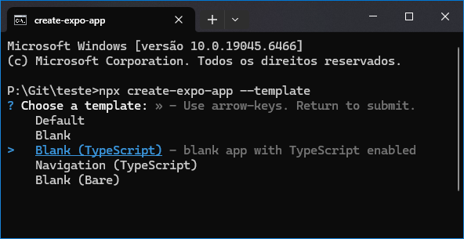

# React Native EXPO - Start

Olá mundo! Este é meu primeiro projeto de React Native, aqui farei anotações do passo a passo para baixar, configurar e executar um projeto no framework.

## Bainxando o React Native Expo

Tenha o NodeJS e NPM instalado:

- [Site oficial NodeJS](https://nodejs.org/pt-br)

Abra o terminal CMD na pasta que deseja criar o projeto:

 - `npx create-expo-app --template`
 - Selecione Blanck TypeScript:

    

 - Digite o nome do projeto e pronto!

Caso já esteja dentro da pasta do projeto use ponto `.` para informar ao sistema que não quer criar uma pasta com o nome do projeto:

 - `npx create-expo-app . --template`